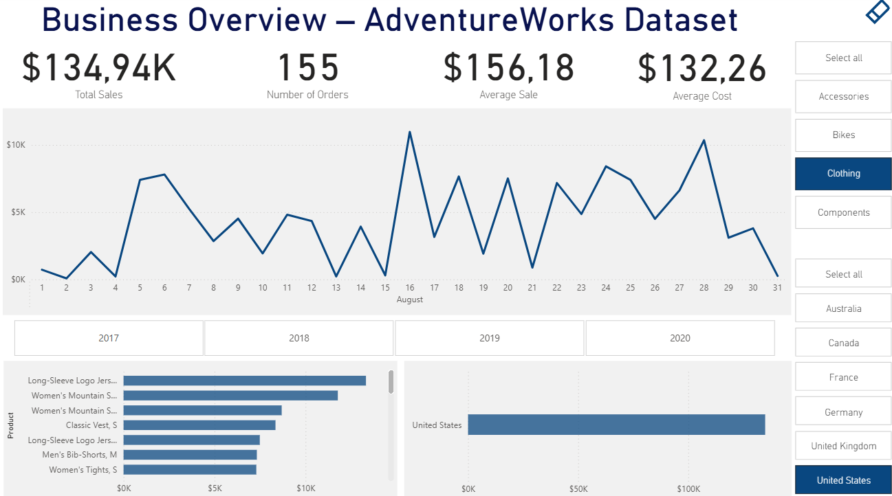

# AdventureWorks Sales Dashboard (Power BI)

An interactive sales dashboard based on the AdventureWorks data model. Created in Power BI as a demonstration of business data analysis using relationships, KPIs, and visualizations.

## What's included in the dashboard?

- Total sales, average order value, number of orders
- Monthly and yearly trends (with drill-down functionality)
- Sales by country
- Sales analysis by product and category

## Technologies
- Power BI
- Relational data model (AdventureWorks)
- KPIs, line charts, bar charts, and maps
- Interactive slicers

## Data Sourcee
AdventureWorks Dataset: [AdventureWorks Sample Database](https://learn.microsoft.com/en-us/sql/samples/adventureworks-install-configure)

